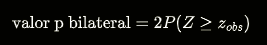

Objetivo: Teste a uma proporção


# código 


```{r echo=FALSE, results=FALSE}
# Obrigatório
VAR         = 1  # Só mostra a variante escolhida em VAR
VARCOUNT    = 3  # total de variantes

#Avoid scientific notation in all document
options(scipen = 999)

#Na commandline: str(knitr::opts_chunk$get())
knitr::opts_chunk$set(echo = TRUE) 


VAR      <- 1  # Só mostra a variante escolhida em VAR
VARCOUNT <- 6  # total de variantes


SET.SEED <- 10
set.seed(SET.SEED)


PROPTEST_P0 <- c(0.60, 0.65, 0.70)

PROPTEST_SUCESSOS  <- c(23, 27, 22)
PROPTEST_DIM       <- c(30, 35, 40)

R_PROPTEST_PESTIMADO = PROPTEST_SUCESSOS / PROPTEST_DIM

PROPTEST_H1 <- c(
             "significativamente maior",
             "significativamente maior",
             "significativamente menor"
)

PROPTEST_H1_SINAL <- c(">", ">", "<")

ALPHA_PROPTEST <- c(10,  5,  5)
               #  H1  H0  H0 (ver abaixo)

# Estes cat() não aparecem no Moodle. Só o enredo e alíneas escolhidas.
cat(PROPTEST_P0 * PROPTEST_DIM,'\n') #escolher os valores de PROPTEST_SUCESSOS
cat(R_PROPTEST_PESTIMADO,'\n') #obj: existirem mais de 3 casas decimais


R_PROPOBS <- (R_PROPTEST_PESTIMADO - PROPTEST_P0)/sqrt(PROPTEST_P0*(1-PROPTEST_P0)/PROPTEST_DIM)

R_PVALUE_PROP <- c()
R_PVALUE_PROP[1] <- 1 - pnorm( R_PROPOBS[1], 0, 1)
R_PVALUE_PROP[2] <- 1 - pnorm(R_PROPOBS[2], 0, 1)
R_PVALUE_PROP[3] <- pnorm(R_PROPOBS[3], 0, 1)


#Não surge no Moodle.
cat(R_PVALUE_PROP,'\n')


Outro_AlphaCorreto    <- c(5,5,10)
Outro_AlphaIncorreto  <- c(1,10,1)


R_PROPTEST_CONCLUSAO <- c(
  "é significativamente superior",
  "não é significativamente superior",
  "é significativamente inferior"
) 

R_PROPTEST_CONCLUSAO_ERRADA1 <- c(
  "não é significativamente superior",
  "é significativamente superior",
  "não é significativamente inferior",
  "é significativamente inferior"
)

R_PROPTEST_CONCLUSAO_ERRADA2 <- c(
  "não é significativamente igual",
  "é significativamente igual",
  "não é significativamente igual",
  "é significativamente igual"
)  


```


# enredo


Numa pequena amostra de `r PROPTEST_DIM[VAR]` árvores foram observadas `r PROPTEST_SUCESSOS[VAR]` árvores com galhas em vez de sementes.

Pretende-se saber se a proporção de árvores infetadas é `r PROPTEST_H1[VAR]` face à proporção de árvores infetadas há 20 anos.


Formulário:




# alínea prop01

Com base nos dados observados, a proporção estimada de árvores infetadas é {:NUMERICAL:=`r R_PROPTEST_PESTIMADO[VAR]`:0.001} (escreve um número entre 0 e 1, e com 3 casas decimais).


# alínea th01

O valor-p do teste pretendido é {2:NUMERICAL:=`r R_PVALUE_PROP[VAR]`:0.001} (3 casas decimais).


# alínea Tobs01


O valor observado da estatística de teste associado ao teste pretendido é {2:NUMERICAL:=`r R_PROPOBS[VAR]`:0.001} (3 casas decimais).


# alínea concl01

Ao nível de significância de `r ALPHA_PROPTEST[VAR]`%, a conclusão do teste de hipóteses é que a proporção de árvores infetadas agora
{:MULTICHOICE_S:= `r R_PROPTEST_CONCLUSAO[VAR]` ~ `r R_PROPTEST_CONCLUSAO_ERRADA1[VAR]` ~ `r R_PROPTEST_CONCLUSAO_ERRADA2[VAR]` } comparado à proporção de árvores infetadas em África do Sul.


# alínea concl02

Ao nível de significância de {1:MULTICHOICE_S:=`r Outro_AlphaCorreto[VAR]`% \~`r Outro_AlphaIncorreto[VAR]`%} , a conclusão do teste de hipóteses é que a proporção de árvores infetadas agora
`r R_PROPTEST_CONCLUSAO[VAR]` comparado à proporção de árvores infetadas no passado.


