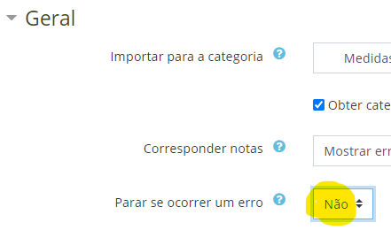

# moodle questions


O modo matemática a usar no ficheiro Rmd é com  `\(\bar x\)`


Resultado numérico arredondado a 4 casas decimais:

```{2:NUMERICAL:=`r round(var,4)`:0.001}```

Utilização de shortanswer:

```{2:SHORTANSWER_S:=alguma palavra ou frase correta=outra correta~esta é errada~esta é outra errada}```

* não usar LaTeX na shortanswer.
* o moodle permite facilmente que o professor corrija e adapte a classificação lendo cada resposta de cada aluno.

 
Colocar código r deve ser com três plicas e a letra r:

<pre>
```r
> x = matrix( c(A,B,C,D),nrow=2)
```
</pre>


## moodle import process


To create an exam, using this package, one must **stricly**  follow an easy structure :doc:`moodle`.

1. In moodle, create category "imported" ("importados")

Move moodle Category "imported" to the top (for ease of use). 

("É útil que a categoria "importados" surja no topo:")

a. Colocar como subcategoria de outra que seja vísivel no topo
b. Voltar a promover

**import to moodle**


2. No processo de importar abrir "Geral" => "Para em erros = Não"




4. Import
5. Procurar categorias com (0) (onde houve erros)

To delete imported exam and repeat:

1. Open main `Category` where question exam bank is;
2. Select everything below
3. Delete

Eventaully,

* Is necessary to delete subcategories one by one.


